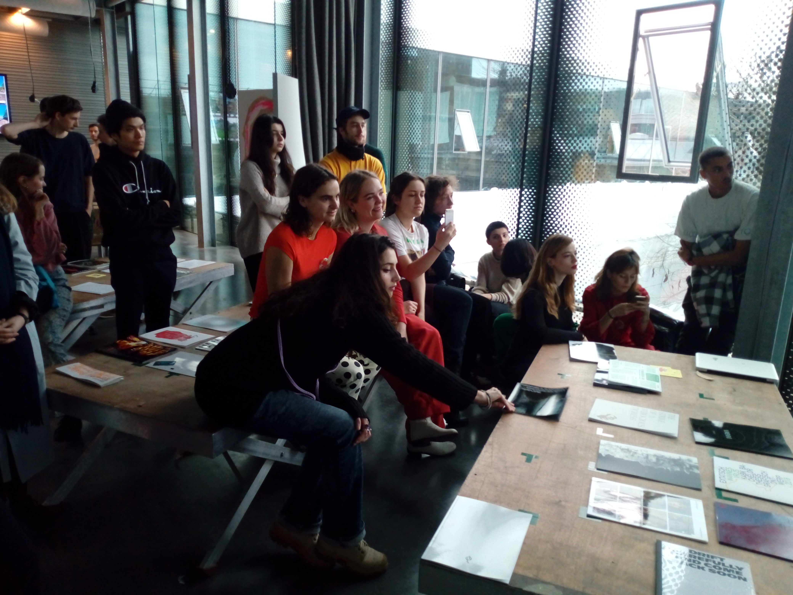
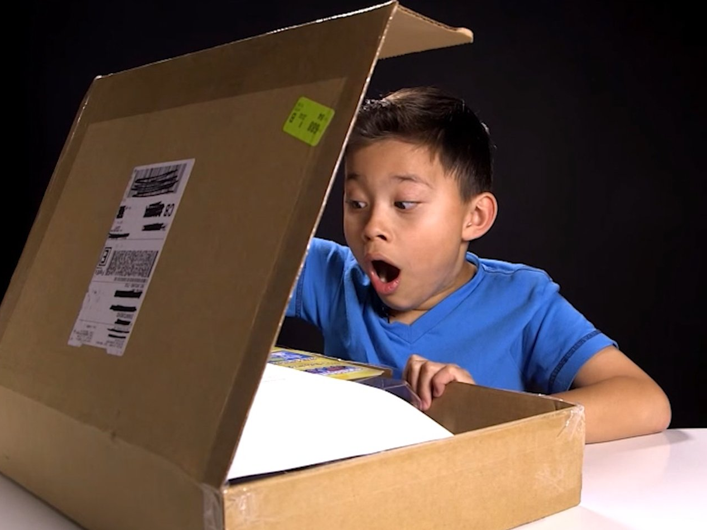

# Graphic Design Theses 2019-2020

## The Assignment

Conceive, write and design your thesis for the following media:

1. **web** (HTML/CSS/JavaScript, distribution: git/Github)
2. **print** (HTML/CSS, distribution: Pumbo/Print on Demand)

Unbox and present you theses during the **Open Day** (25/01/2020)

## Mobile First (and Only)

Since we have very little time this year, we will focus on web design for **mobile phones**. We will also use the mobile as presentation device during the open day.

This means that we will keep in mind the limits and affordances of mobile phones (small screen, multiple orientation, etc.) when designing the thesis. We won't worry too much of desktop, since generally what works on smaller screens works also on bigger ones.

Working with the mobile sensors (camera, gyroscope, etc.) is possible but generally difficult with websites), so it's discouraged.

## Print on Demand

We will use [Pumbo](https://www.pumbo.nl/kosten/boek-maken/drukken-in-grote-oplage/paperback) to print the theses.

The format will be 'Pocket' (150x215mm). [is this ok Thomas?]

## Open day

During the Open Day (25/01/2020) we will do a sort of public performance consisting in displaying and 'unboxing' the printed theses.

We will also organize a small program of public presentations of the theses.

## Extra-Team

Who wants to design the **landing page** for this year's theses? Here you can see [2019](https://kabk.github.io/go-theses-19/) and [2018](https://kabk.github.io/go-theses-18/) versions.

Also, who wants to organize the **unboxing** during the Open Day?

Generally, it is good to have a group of ~5 people to keep track of these tasks. This doesn't mean however that these ~5 people need to do all by themselves: they can delegate subtasks to other students.

## Deadlines

**18/12/2019**: you have talked to Silvio and Thomas at least once and you have a sound direction for the design (both in print and web) of your thesis

**17/01/2020**: your print design is ready so there is time to send it to Pumbo to ave it printed on demand

**22/01/2020**: both your print and web designs are ready for the collectives

**25/01/2020**: Open Day, unboxing and presentations

## git/Github sesh

You should have a Github account by now and I should have added you to the KABK team. So now we will go trough the process of creating a repository and pushing stuff to it with the Terminal to understand conceptually what goes on when we do so. Generally you are free to use the app provided by [Github](https://desktop.github.com/).

## Tips

todo

---

how to do web design for mobile
