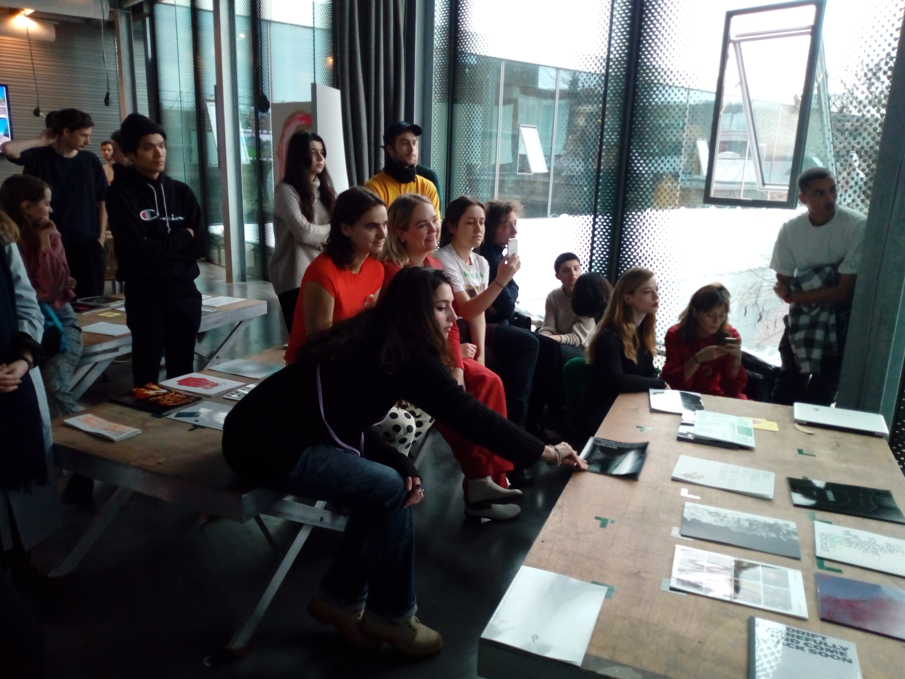
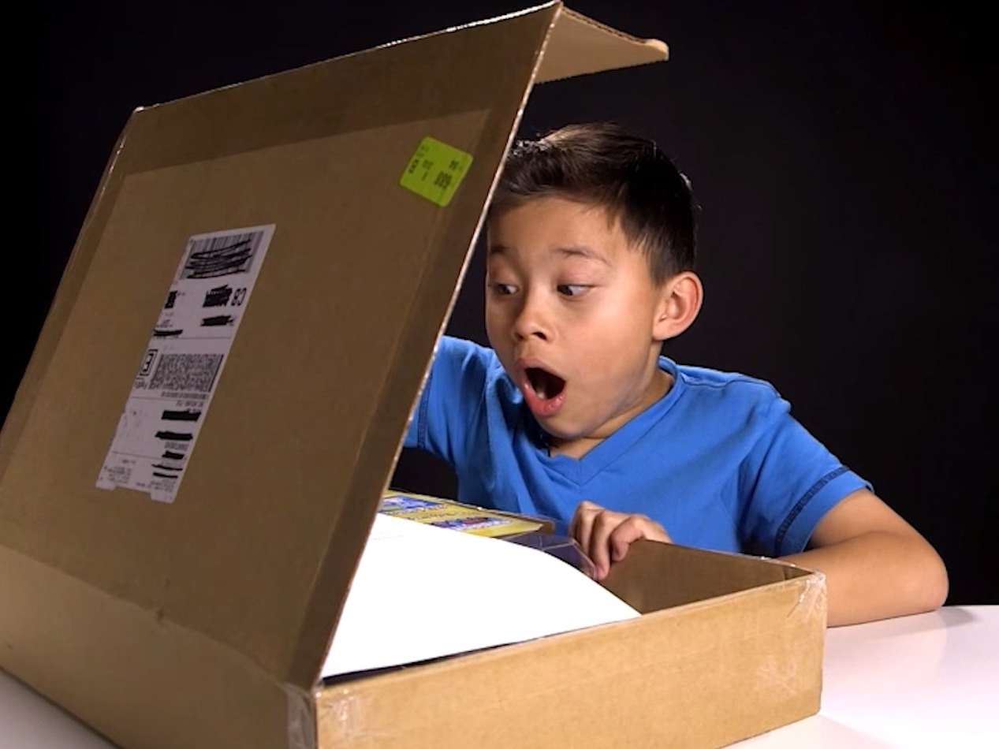
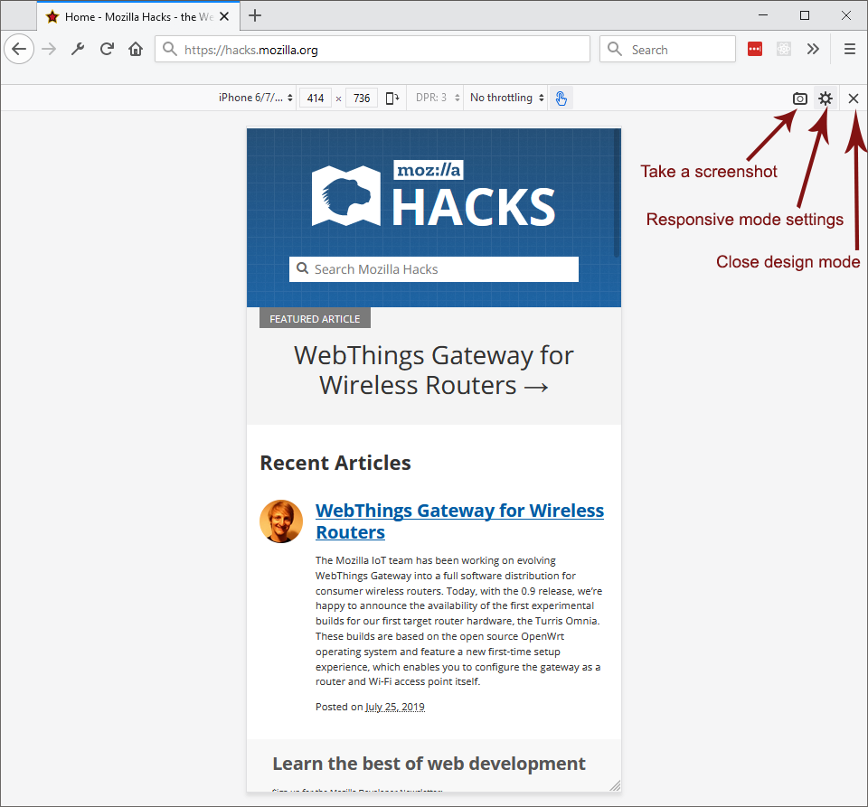

# Graphic Design Theses 2019-2020

## The Assignment

Conceive, write and design your thesis for the following media:

1. **web** (HTML/CSS/JavaScript, distribution: git/Github)
2. **print** (HTML/CSS, distribution: Pumbo/Print on Demand)

Unbox and present you theses during the **Open Day** (25/01/2020)

## Mobile First (and Only)

Since we have very little time this year, we will focus on web design for **mobile phones**. We will also use the mobile as presentation device during the open day.

This means that we will keep in mind the limits and affordances of mobile phones (small screen, multiple orientation, etc.) when designing the thesis. We won't worry too much of desktop, since generally what works on smaller screens works also on bigger ones.

Working with the mobile sensors (camera, gyroscope, etc.) is possible but generally difficult with websites), so it's discouraged.

## Print on Demand

We will use [Pumbo](https://www.pumbo.nl/kosten/boek-maken/drukken-in-grote-oplage/paperback) to print the theses.

The format will be 'A4' (210×297 mm).

You will also design a poster that functions as dust jacket for the publication. The posters will be presented during the collectives.

### Some examples of print on demand publications

Dear Lulu by James Goggin (2008)

The Book by Benjamin Shaykin (2008)

The Black Book by Jean Keller (2013)

56 Broken Kindle Screens by Silvio Lorusso & Sebastian Schmieg (2012) [shameless plug].

You find a lot more [here](http://p-dpa.net/tech/pod/).

## Open day

During the Open Day (25/01/2020) we will do a public performance consisting in displaying and 'unboxing' the printed theses.

We will also organize a small program of public presentations of the theses.

## Extra-Team

Who wants to design the **landing page** for this year's theses? Here you can see [2019](https://kabk.github.io/go-theses-19/) and [2018](https://kabk.github.io/go-theses-18/) versions.

Also, who wants to organize the **unboxing** during the Open Day?

Generally, it is good to have a group of ~5 people to keep track of these tasks. This doesn't mean however that these ~5 people need to do all by themselves: they can delegate subtasks to other students.

Please write to me either via email (s.lorusso [at] kabk [dot] nl) or Slack to let me know that you want to be part of the extra team.

## Deadlines

**18/12/2019**: you have talked to Silvio and Thomas at least once and you have a sound direction for the design (both in print and web) of your thesis

**17/01/2020**: your print design is ready so there is time to send it to Pumbo to ave it printed on demand

**19/01/2020**: both your print and web designs are ready for the Individual Feedback, which means that the websites are published on Github and thus accessible online

**22-3/01/2020**: the collectives take place

**25/01/2020**: Open Day, unboxing and presentations

## Tips

- Use the [responsive mode](https://developer.mozilla.org/en-US/docs/Tools/Responsive_Design_Mode) of the console of your browser to test your design
- Test also on the actual mobile phone, as the rendering might be different.
- If something doesn't work, *isolate the problem*: create a [CodePen](https://codepen.io/#) only including what is needed to reproduce the bug
- Be tidy with your code: give proper indentation, separate sections, comment complicated parts etc. In this way you and others will be able to navigate your code. Here's some [tips](https://code.tutsplus.com/tutorials/top-15-best-practices-for-writing-super-readable-code--net-8118)
- Think of the invisible structure of your page ahead (what div contains what div)

## git/Github sesh

You should have a Github account by now and I should have added you to the KABK team. So now we will go trough the process of creating a repository and pushing stuff to it with the Terminal to understand conceptually what goes on when we do so. Generally you can use the git engine included in Atom or the app provided by [Github](https://desktop.github.com/).
